```python
import numpy as np
import pandas as pd
import matplotlib.pyplot as plt
import seaborn as sns
from sklearn.utils.multiclass import unique_labels

```


```python
import matplotlib
matplotlib.rcParams.update({'font.size': 20})
```


```python
def plot_confusion_matrix(y_true, y_pred, classes,
                          normalize=False,
                          title=None,
                          cmap=plt.cm.Blues):
    """
    This function prints and plots the confusion matrix.
    Normalization can be applied by setting `normalize=True`.
    """


    if not title:
        if normalize:
            title = 'Normalized confusion matrix'
        else:
            title = 'Confusion matrix, without normalization'

    # Compute confusion matrix
    cm = confusion_matrix(y_true, y_pred)
    # Only use the labels that appear in the data
    classes = classes[unique_labels(y_true, y_pred)]
    if normalize:
        cm = cm.astype('float') / cm.sum(axis=1)[:, np.newaxis]
        print("Normalized confusion matrix")
    else:
        print('Confusion matrix, without normalization')

#     print(cm)

    fig, ax = plt.subplots(figsize = (25,25))
    im = ax.imshow(cm, interpolation='nearest', cmap=cmap)
    ax.figure.colorbar(im, ax=ax)
    # We want to show all ticks...
    ax.set(xticks=np.arange(cm.shape[1]),
           yticks=np.arange(cm.shape[0]),
           # ... and label them with the respective list entries
           xticklabels=classes, yticklabels=classes,
           title=title,
           ylabel='True label',
           xlabel='Predicted label')

    # Rotate the tick labels and set their alignment.
    plt.setp(ax.get_xticklabels(), rotation=45, ha="right",
             rotation_mode="anchor")

    # Loop over data dimensions and create text annotations.
    fmt = '.2f' if normalize else 'd'
    thresh = cm.max() / 2.
    for i in range(cm.shape[0]):
        for j in range(cm.shape[1]):
            ax.text(j, i, format(cm[i, j], fmt),
                    ha="center", va="center",
                    color="white" if cm[i, j] > thresh else "black")
    fig.tight_layout()
    return ax

```

# First look


```python
data1 = pd.read_csv('craigslistVehiclesFull.csv')
```


```python
len(data1[data1.state_name == 'California'].city.unique())
```


    263


```python
data1.head()
```


<div>
<style scoped>
    .dataframe tbody tr th:only-of-type {
        vertical-align: middle;
    }

    .dataframe tbody tr th {
        vertical-align: top;
    }

    .dataframe thead th {
        text-align: right;
    }
</style>
<table border="1" class="dataframe">
  <thead>
    <tr style="text-align: right;">
      <th></th>
      <th>url</th>
      <th>city</th>
      <th>price</th>
      <th>year</th>
      <th>manufacturer</th>
      <th>make</th>
      <th>condition</th>
      <th>cylinders</th>
      <th>fuel</th>
      <th>odometer</th>
      <th>...</th>
      <th>paint_color</th>
      <th>image_url</th>
      <th>lat</th>
      <th>long</th>
      <th>county_fips</th>
      <th>county_name</th>
      <th>state_fips</th>
      <th>state_code</th>
      <th>state_name</th>
      <th>weather</th>
    </tr>
  </thead>
  <tbody>
    <tr>
      <th>0</th>
      <td>https://marshall.craigslist.org/cto/d/2010-dod...</td>
      <td>marshall</td>
      <td>11900</td>
      <td>2010.0</td>
      <td>dodge</td>
      <td>challenger se</td>
      <td>good</td>
      <td>6 cylinders</td>
      <td>gas</td>
      <td>43600.0</td>
      <td>...</td>
      <td>red</td>
      <td>https://images.craigslist.org/00i0i_2ggH1eKDNK...</td>
      <td>43.4775</td>
      <td>-96.7041</td>
      <td>46083.0</td>
      <td>Lincoln</td>
      <td>46.0</td>
      <td>SD</td>
      <td>South Dakota</td>
      <td>38.0</td>
    </tr>
    <tr>
      <th>1</th>
      <td>https://marshall.craigslist.org/cto/d/fleetwoo...</td>
      <td>marshall</td>
      <td>1515</td>
      <td>1999.0</td>
      <td>NaN</td>
      <td>fleetwood</td>
      <td>NaN</td>
      <td>NaN</td>
      <td>gas</td>
      <td>NaN</td>
      <td>...</td>
      <td>NaN</td>
      <td>https://images.craigslist.org/00M0M_irjh7SjEcU...</td>
      <td>44.7612</td>
      <td>-96.6907</td>
      <td>46039.0</td>
      <td>Deuel</td>
      <td>46.0</td>
      <td>SD</td>
      <td>South Dakota</td>
      <td>38.0</td>
    </tr>
    <tr>
      <th>2</th>
      <td>https://marshall.craigslist.org/cto/d/2008-for...</td>
      <td>marshall</td>
      <td>17550</td>
      <td>2008.0</td>
      <td>ford</td>
      <td>f-150</td>
      <td>NaN</td>
      <td>NaN</td>
      <td>gas</td>
      <td>NaN</td>
      <td>...</td>
      <td>NaN</td>
      <td>https://images.craigslist.org/00s0s_eL2XFhEUcx...</td>
      <td>44.1415</td>
      <td>-103.2052</td>
      <td>46093.0</td>
      <td>Meade</td>
      <td>46.0</td>
      <td>SD</td>
      <td>South Dakota</td>
      <td>38.0</td>
    </tr>
    <tr>
      <th>3</th>
      <td>https://marshall.craigslist.org/cto/d/ford-tau...</td>
      <td>marshall</td>
      <td>2800</td>
      <td>2004.0</td>
      <td>ford</td>
      <td>taurus</td>
      <td>good</td>
      <td>6 cylinders</td>
      <td>gas</td>
      <td>168591.0</td>
      <td>...</td>
      <td>grey</td>
      <td>https://images.craigslist.org/00L0L_5HUR1nQjt8...</td>
      <td>43.2845</td>
      <td>-95.5930</td>
      <td>19143.0</td>
      <td>Osceola</td>
      <td>19.0</td>
      <td>IA</td>
      <td>Iowa</td>
      <td>47.0</td>
    </tr>
    <tr>
      <th>4</th>
      <td>https://marshall.craigslist.org/cto/d/2001-gra...</td>
      <td>marshall</td>
      <td>400</td>
      <td>2001.0</td>
      <td>NaN</td>
      <td>2001 Grand Prix</td>
      <td>NaN</td>
      <td>NaN</td>
      <td>gas</td>
      <td>217000.0</td>
      <td>...</td>
      <td>NaN</td>
      <td>https://images.craigslist.org/00n0n_bJJ1XnonSG...</td>
      <td>43.0261</td>
      <td>-94.4064</td>
      <td>19109.0</td>
      <td>Kossuth</td>
      <td>19.0</td>
      <td>IA</td>
      <td>Iowa</td>
      <td>47.0</td>
    </tr>
  </tbody>
</table>
<p>5 rows × 26 columns</p>
</div>


```python
data1.columns
```


    Index(['url', 'city', 'price', 'year', 'manufacturer', 'make', 'condition',
           'cylinders', 'fuel', 'odometer', 'title_status', 'transmission', 'vin',
           'drive', 'size', 'type', 'paint_color', 'image_url', 'lat', 'long',
           'county_fips', 'county_name', 'state_fips', 'state_code', 'state_name',
           'weather'],
          dtype='object')


```python
data1.info()
```

    <class 'pandas.core.frame.DataFrame'>
    RangeIndex: 1723065 entries, 0 to 1723064
    Data columns (total 26 columns):
    url             object
    city            object
    price           int64
    year            float64
    manufacturer    object
    make            object
    condition       object
    cylinders       object
    fuel            object
    odometer        float64
    title_status    object
    transmission    object
    vin             object
    drive           object
    size            object
    type            object
    paint_color     object
    image_url       object
    lat             float64
    long            float64
    county_fips     float64
    county_name     object
    state_fips      float64
    state_code      object
    state_name      object
    weather         float64
    dtypes: float64(7), int64(1), object(18)
    memory usage: 341.8+ MB


```python
drop_index = data1[data1.state_name == 'FAILED'].index
```


```python
data1 = data1.drop(data1.index[drop_index])
```


```python
data1.info()
```

    <class 'pandas.core.frame.DataFrame'>
    Int64Index: 1664232 entries, 0 to 1723064
    Data columns (total 26 columns):
    url             1664232 non-null object
    city            1664232 non-null object
    price           1664232 non-null int64
    year            1657921 non-null float64
    manufacturer    1531482 non-null object
    make            1596002 non-null object
    condition       980534 non-null object
    cylinders       998921 non-null object
    fuel            1655155 non-null object
    odometer        1113723 non-null float64
    title_status    1662935 non-null object
    transmission    1656491 non-null object
    vin             586279 non-null object
    drive           1023133 non-null object
    size            577837 non-null object
    type            983388 non-null object
    paint_color     994317 non-null object
    image_url       1664231 non-null object
    lat             1664232 non-null float64
    long            1664232 non-null float64
    county_fips     1664232 non-null float64
    county_name     1664232 non-null object
    state_fips      1664232 non-null float64
    state_code      1664232 non-null object
    state_name      1664232 non-null object
    weather         1663637 non-null float64
    dtypes: float64(7), int64(1), object(18)
    memory usage: 342.8+ MB


```python
max(data1.year) # data up to date
```


    2019.0


```python
data1.isnull().sum(axis = 0)
```


    url                   0
    city                  0
    price                 0
    year               6311
    manufacturer     132750
    make              68230
    condition        683698
    cylinders        665311
    fuel               9077
    odometer         550509
    title_status       1297
    transmission       7741
    vin             1077953
    drive            641099
    size            1086395
    type             680844
    paint_color      669915
    image_url             1
    lat                   0
    long                  0
    county_fips           0
    county_name           0
    state_fips            0
    state_code            0
    state_name            0
    weather             595
    dtype: int64


```python
data2 = pd.read_csv('craigslistVehicles.csv')
```


```python
data2.head()
```


<div>
<style scoped>
    .dataframe tbody tr th:only-of-type {
        vertical-align: middle;
    }

    .dataframe tbody tr th {
        vertical-align: top;
    }

    .dataframe thead th {
        text-align: right;
    }
</style>
<table border="1" class="dataframe">
  <thead>
    <tr style="text-align: right;">
      <th></th>
      <th>url</th>
      <th>city</th>
      <th>city_url</th>
      <th>price</th>
      <th>year</th>
      <th>manufacturer</th>
      <th>make</th>
      <th>condition</th>
      <th>cylinders</th>
      <th>fuel</th>
      <th>...</th>
      <th>transmission</th>
      <th>VIN</th>
      <th>drive</th>
      <th>size</th>
      <th>type</th>
      <th>paint_color</th>
      <th>image_url</th>
      <th>desc</th>
      <th>lat</th>
      <th>long</th>
    </tr>
  </thead>
  <tbody>
    <tr>
      <th>0</th>
      <td>https://albuquerque.craigslist.org/cto/d/albuq...</td>
      <td>albuquerque</td>
      <td>https://albuquerque.craigslist.org</td>
      <td>1500</td>
      <td>2005.0</td>
      <td>hyundai</td>
      <td>elantra</td>
      <td>good</td>
      <td>4 cylinders</td>
      <td>gas</td>
      <td>...</td>
      <td>automatic</td>
      <td>NaN</td>
      <td>fwd</td>
      <td>mid-size</td>
      <td>sedan</td>
      <td>blue</td>
      <td>https://images.craigslist.org/00C0C_jxcguIkSFN...</td>
      <td>Selling a 2005 Hyundai Elantra 2.0 4 cylinder....</td>
      <td>35.156142</td>
      <td>-106.656501</td>
    </tr>
    <tr>
      <th>1</th>
      <td>https://albuquerque.craigslist.org/cto/d/albuq...</td>
      <td>albuquerque</td>
      <td>https://albuquerque.craigslist.org</td>
      <td>10000</td>
      <td>2010.0</td>
      <td>bmw</td>
      <td>535xi</td>
      <td>good</td>
      <td>6 cylinders</td>
      <td>gas</td>
      <td>...</td>
      <td>automatic</td>
      <td>NaN</td>
      <td>NaN</td>
      <td>NaN</td>
      <td>sedan</td>
      <td>white</td>
      <td>https://images.craigslist.org/00t0t_cy5QmA1gOF...</td>
      <td>2010 BMW 535xi\nAll wheel drive \n120,000\nCle...</td>
      <td>35.151887</td>
      <td>-106.708317</td>
    </tr>
    <tr>
      <th>2</th>
      <td>https://albuquerque.craigslist.org/ctd/d/albuq...</td>
      <td>albuquerque</td>
      <td>https://albuquerque.craigslist.org</td>
      <td>2000</td>
      <td>2005.0</td>
      <td>toyota</td>
      <td>tacoma</td>
      <td>NaN</td>
      <td>NaN</td>
      <td>gas</td>
      <td>...</td>
      <td>automatic</td>
      <td>NaN</td>
      <td>NaN</td>
      <td>NaN</td>
      <td>NaN</td>
      <td>NaN</td>
      <td>https://images.craigslist.org/00E0E_izNM6a51mb...</td>
      <td>Contact at amandafiorello(at)hotmail.com\n\n \...</td>
      <td>35.058537</td>
      <td>-106.877873</td>
    </tr>
    <tr>
      <th>3</th>
      <td>https://albuquerque.craigslist.org/cto/d/rio-r...</td>
      <td>albuquerque</td>
      <td>https://albuquerque.craigslist.org</td>
      <td>2300</td>
      <td>1971.0</td>
      <td>ford</td>
      <td>NaN</td>
      <td>fair</td>
      <td>8 cylinders</td>
      <td>gas</td>
      <td>...</td>
      <td>automatic</td>
      <td>NaN</td>
      <td>rwd</td>
      <td>NaN</td>
      <td>NaN</td>
      <td>NaN</td>
      <td>https://images.craigslist.org/01414_gX7P5ovXx0...</td>
      <td>CLASSIC FORD NEEDS A HOME. SERIOUS BUYERS ONLY...</td>
      <td>35.249300</td>
      <td>-106.681800</td>
    </tr>
    <tr>
      <th>4</th>
      <td>https://albuquerque.craigslist.org/cto/d/albuq...</td>
      <td>albuquerque</td>
      <td>https://albuquerque.craigslist.org</td>
      <td>2000</td>
      <td>1998.0</td>
      <td>toyota</td>
      <td>camry</td>
      <td>good</td>
      <td>6 cylinders</td>
      <td>gas</td>
      <td>...</td>
      <td>automatic</td>
      <td>NaN</td>
      <td>NaN</td>
      <td>compact</td>
      <td>NaN</td>
      <td>NaN</td>
      <td>https://images.craigslist.org/00L0L_oXTsooKih6...</td>
      <td>Good running car. Great on gas. It has a sunro...</td>
      <td>35.058537</td>
      <td>-106.877873</td>
    </tr>
  </tbody>
</table>
<p>5 rows × 22 columns</p>
</div>


```python
data2.info()
```

    <class 'pandas.core.frame.DataFrame'>
    RangeIndex: 443405 entries, 0 to 443404
    Data columns (total 22 columns):
    url             443405 non-null object
    city            443405 non-null object
    city_url        443405 non-null object
    price           443405 non-null int64
    year            442625 non-null float64
    manufacturer    416632 non-null object
    make            431719 non-null object
    condition       247168 non-null object
    cylinders       265822 non-null object
    fuel            439771 non-null object
    odometer        350614 non-null float64
    title_status    441334 non-null object
    transmission    440070 non-null object
    VIN             240560 non-null object
    drive           309654 non-null object
    size            152501 non-null object
    type            311390 non-null object
    paint_color     297871 non-null object
    image_url       443393 non-null object
    desc            443391 non-null object
    lat             442580 non-null float64
    long            442580 non-null float64
    dtypes: float64(4), int64(1), object(17)
    memory usage: 74.4+ MB


```python
data2.columns
```


    Index(['url', 'city', 'city_url', 'price', 'year', 'manufacturer', 'make',
           'condition', 'cylinders', 'fuel', 'odometer', 'title_status',
           'transmission', 'VIN', 'drive', 'size', 'type', 'paint_color',
           'image_url', 'desc', 'lat', 'long'],
          dtype='object')


```python
data2.isnull().sum(axis = 0)
```


    url                  0
    city                 0
    city_url             0
    price                0
    year               780
    manufacturer     26773
    make             11686
    condition       196237
    cylinders       177583
    fuel              3634
    odometer         92791
    title_status      2071
    transmission      3335
    VIN             202845
    drive           133751
    size            290904
    type            132015
    paint_color     145534
    image_url           12
    desc                14
    lat                825
    long               825
    dtype: int64


```python
plt.figure(figsize = (10,5))
sns.barplot(x = data2.isnull().sum(axis = 0).index, y = 100*data2.isnull().sum(axis = 0).values/1664232)
plt.xticks(rotation=90)                                                               
plt.ylabel('NAN count (%)')
plt.xlabel('column name')
plt.tight_layout()

plt.savefig('nan.jpg')
```


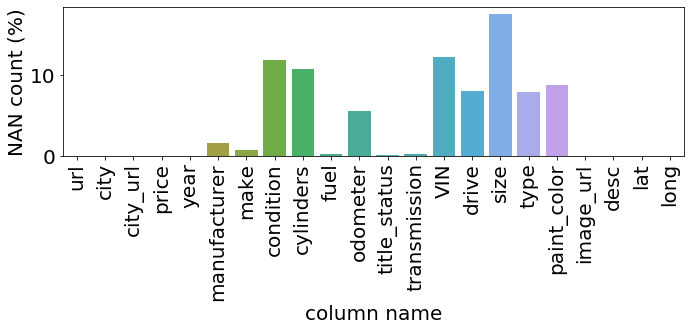


data 2 looks like a smaller set than data 1, however, as data 2 doesn't have state name, it will need to convert it to state name, so let us work on data 1 first

Note that, in data 1, there are in total 1723064 entries, but the number of NAN in each column is:

url                   0
city                  0
price                 0
year               6315
manufacturer     136414
make              69699
condition        700790
cylinders        691291
fuel              10367
odometer         564054
title_status       2554
transmission       9022
vin             1118215
drive            661884
size            1123967
type             702931
paint_color      695650
image_url             1
lat                   0
long                  0
county_fips       58833
county_name       58833
state_fips        58833
state_code        58833
state_name            0
weather           59428


If we drop NAN on vin and size, that is gonna remove most of our data, so data seleciton become a must. 

First, I remove columns that are not too relevant and also have a lot of NAN:
drop: vin and size 

Second, I remove columns that I am not using in this stage:
drop: url, image_url


```python
data_s = data1.drop(columns = ['vin','size','drive', 'url', 'image_url', \
                               'paint_color', 'condition','cylinders', 'odometer',\
                              'drive','type','paint_color'])
data_s = data_s.dropna()

data_s.info()
```

    <class 'pandas.core.frame.DataFrame'>
    Int64Index: 1441566 entries, 0 to 1723064
    Data columns (total 16 columns):
    city            1441566 non-null object
    price           1441566 non-null int64
    year            1441566 non-null float64
    manufacturer    1441566 non-null object
    make            1441566 non-null object
    fuel            1441566 non-null object
    title_status    1441566 non-null object
    transmission    1441566 non-null object
    lat             1441566 non-null float64
    long            1441566 non-null float64
    county_fips     1441566 non-null float64
    county_name     1441566 non-null object
    state_fips      1441566 non-null float64
    state_code      1441566 non-null object
    state_name      1441566 non-null object
    weather         1441566 non-null float64
    dtypes: float64(6), int64(1), object(9)
    memory usage: 187.0+ MB


# EDA

### find demand distribution across state using data 1 (raw data)


```python
count_state = data1.groupby('state_name').count()# use price for count  because there is no missing values
count_data = pd.DataFrame(data = count_state.index)
count_data['count'] = count_state.price.values
```


```python
sum_state = data1.groupby('state_name').sum()# use price for count  because there is no missing values
sum_data = pd.DataFrame(data = sum_state.index)
sum_data['count'] = sum_state.price.values
```


```python
plt.figure(figsize = (20,10))
sns.barplot(x='state_name', y="count", data = sum_data)
plt.xticks(rotation=90) 
plt.ylabel('total sell ($)')
plt.tight_layout()


plt.savefig('sum_state_sell.jpg')
```


```python
plt.figure(figsize = (20,10))
fbar = sns.barplot(x='state_name', y="count", data = count_data)
plt.xticks(rotation=90)                                                               
plt.ylabel('count')
plt.tight_layout()

plt.savefig('count_state_sell.jpg')
```


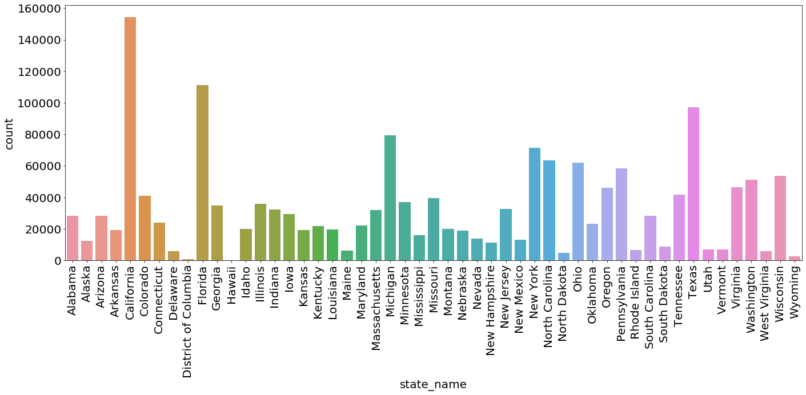


```python
count_state = data1.groupby('state_name').sum()# use price for count  because there is no missing values
```

The above figure may provide insight about market saturation and exploring market
First we need to remove the influence by population
to get the population we need demographic data of the state


```python
demog = pd.read_excel('nst-est2018-01.xlsx')
```


```python
demog_state = demog.iloc[8:59]
demog_state.head()
```


<div>
<style scoped>
    .dataframe tbody tr th:only-of-type {
        vertical-align: middle;
    }

    .dataframe tbody tr th {
        vertical-align: top;
    }

    .dataframe thead th {
        text-align: right;
    }
</style>
<table border="1" class="dataframe">
  <thead>
    <tr style="text-align: right;">
      <th></th>
      <th>table with row headers in column A and column headers in rows 3 through 4. (leading dots indicate sub-parts)</th>
      <th>Unnamed: 1</th>
      <th>Unnamed: 2</th>
      <th>Unnamed: 3</th>
      <th>Unnamed: 4</th>
      <th>Unnamed: 5</th>
      <th>Unnamed: 6</th>
      <th>Unnamed: 7</th>
      <th>Unnamed: 8</th>
      <th>Unnamed: 9</th>
      <th>Unnamed: 10</th>
      <th>Unnamed: 11</th>
    </tr>
  </thead>
  <tbody>
    <tr>
      <th>8</th>
      <td>.Alabama</td>
      <td>4779736</td>
      <td>4780138</td>
      <td>4785448</td>
      <td>4798834.0</td>
      <td>4815564.0</td>
      <td>4830460.0</td>
      <td>4842481.0</td>
      <td>4853160.0</td>
      <td>4864745.0</td>
      <td>4875120.0</td>
      <td>4887871.0</td>
    </tr>
    <tr>
      <th>9</th>
      <td>.Alaska</td>
      <td>710231</td>
      <td>710249</td>
      <td>713906</td>
      <td>722038.0</td>
      <td>730399.0</td>
      <td>737045.0</td>
      <td>736307.0</td>
      <td>737547.0</td>
      <td>741504.0</td>
      <td>739786.0</td>
      <td>737438.0</td>
    </tr>
    <tr>
      <th>10</th>
      <td>.Arizona</td>
      <td>6392017</td>
      <td>6392288</td>
      <td>6407774</td>
      <td>6473497.0</td>
      <td>6556629.0</td>
      <td>6634999.0</td>
      <td>6733840.0</td>
      <td>6833596.0</td>
      <td>6945452.0</td>
      <td>7048876.0</td>
      <td>7171646.0</td>
    </tr>
    <tr>
      <th>11</th>
      <td>.Arkansas</td>
      <td>2915918</td>
      <td>2916028</td>
      <td>2921978</td>
      <td>2940407.0</td>
      <td>2952109.0</td>
      <td>2959549.0</td>
      <td>2967726.0</td>
      <td>2978407.0</td>
      <td>2990410.0</td>
      <td>3002997.0</td>
      <td>3013825.0</td>
    </tr>
    <tr>
      <th>12</th>
      <td>.California</td>
      <td>37253956</td>
      <td>37254523</td>
      <td>37320903</td>
      <td>37641823.0</td>
      <td>37960782.0</td>
      <td>38280824.0</td>
      <td>38625139.0</td>
      <td>38953142.0</td>
      <td>39209127.0</td>
      <td>39399349.0</td>
      <td>39557045.0</td>
    </tr>
  </tbody>
</table>
</div>


```python
state = demog_state['table with row headers in column \
A and column headers in rows 3 through 4. (leading dots indicate sub-parts)']

# state name
```


```python
state.values
```


    array(['.Alabama', '.Alaska', '.Arizona', '.Arkansas', '.California',
           '.Colorado', '.Connecticut', '.Delaware', '.District of Columbia',
           '.Florida', '.Georgia', '.Hawaii', '.Idaho', '.Illinois',
           '.Indiana', '.Iowa', '.Kansas', '.Kentucky', '.Louisiana',
           '.Maine', '.Maryland', '.Massachusetts', '.Michigan', '.Minnesota',
           '.Mississippi', '.Missouri', '.Montana', '.Nebraska', '.Nevada',
           '.New Hampshire', '.New Jersey', '.New Mexico', '.New York',
           '.North Carolina', '.North Dakota', '.Ohio', '.Oklahoma',
           '.Oregon', '.Pennsylvania', '.Rhode Island', '.South Carolina',
           '.South Dakota', '.Tennessee', '.Texas', '.Utah', '.Vermont',
           '.Virginia', '.Washington', '.West Virginia', '.Wisconsin',
           '.Wyoming'], dtype=object)


```python
for i, item in enumerate(state.values):
    state.values[i]=item.replace('.',"")
    
```


```python
state.values
```


    array(['Alabama', 'Alaska', 'Arizona', 'Arkansas', 'California',
           'Colorado', 'Connecticut', 'Delaware', 'District of Columbia',
           'Florida', 'Georgia', 'Hawaii', 'Idaho', 'Illinois', 'Indiana',
           'Iowa', 'Kansas', 'Kentucky', 'Louisiana', 'Maine', 'Maryland',
           'Massachusetts', 'Michigan', 'Minnesota', 'Mississippi',
           'Missouri', 'Montana', 'Nebraska', 'Nevada', 'New Hampshire',
           'New Jersey', 'New Mexico', 'New York', 'North Carolina',
           'North Dakota', 'Ohio', 'Oklahoma', 'Oregon', 'Pennsylvania',
           'Rhode Island', 'South Carolina', 'South Dakota', 'Tennessee',
           'Texas', 'Utah', 'Vermont', 'Virginia', 'Washington',
           'West Virginia', 'Wisconsin', 'Wyoming'], dtype=object)


```python
population = demog_state['Unnamed: 11']

# state population
```


```python
population[58]
```


    577737.0


```python
plt.figure(figsize = (20,10))
fbar = sns.barplot(x=state.values, y=population)
plt.xticks(rotation=90)                                                               
plt.ylabel('population')
plt.xlabel('state')
plt.tight_layout()

plt.savefig('count_state_population.jpg')
```


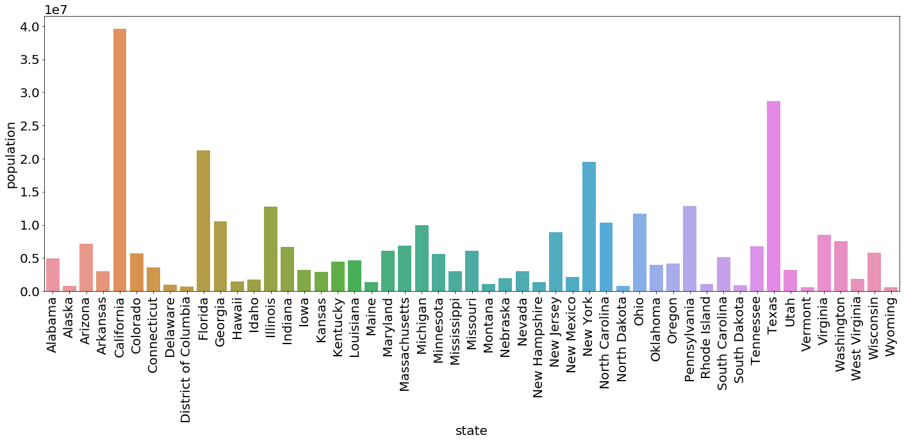


```python
car_per_cap = pd.read_excel('mv1.xls')
```


```python
car_per_cap2 = car_per_cap.iloc[12:63]
```


```python
car_per_cap2.head()
```


<div>
<style scoped>
    .dataframe tbody tr th:only-of-type {
        vertical-align: middle;
    }

    .dataframe tbody tr th {
        vertical-align: top;
    }

    .dataframe thead th {
        text-align: right;
    }
</style>
<table border="1" class="dataframe">
  <thead>
    <tr style="text-align: right;">
      <th></th>
      <th></th>
      <th>Unnamed: 1</th>
      <th>Unnamed: 2</th>
      <th>Unnamed: 3</th>
      <th>Unnamed: 4</th>
      <th>Unnamed: 5</th>
      <th>Unnamed: 6</th>
      <th>Unnamed: 7</th>
      <th>Unnamed: 8</th>
      <th>Unnamed: 9</th>
      <th>Unnamed: 10</th>
      <th>Unnamed: 11</th>
      <th>Unnamed: 12</th>
      <th>Unnamed: 13</th>
      <th>Unnamed: 14</th>
      <th>Unnamed: 15</th>
      <th>Unnamed: 16</th>
    </tr>
  </thead>
  <tbody>
    <tr>
      <th>12</th>
      <td>Alabama</td>
      <td>2194004</td>
      <td>17546</td>
      <td>2211550</td>
      <td>2377</td>
      <td>6436</td>
      <td>8813</td>
      <td>NaN</td>
      <td>2405278</td>
      <td>28197</td>
      <td>2433475</td>
      <td>4601659</td>
      <td>52179</td>
      <td>4653838</td>
      <td>0.465946</td>
      <td>122793</td>
      <td>496</td>
    </tr>
    <tr>
      <th>13</th>
      <td>Alaska</td>
      <td>225656</td>
      <td>2751</td>
      <td>228407</td>
      <td>2312</td>
      <td>483</td>
      <td>2795</td>
      <td>NaN</td>
      <td>468446</td>
      <td>10796</td>
      <td>479242</td>
      <td>696414</td>
      <td>14030</td>
      <td>710444</td>
      <td>0.32307</td>
      <td>30186</td>
      <td>8</td>
    </tr>
    <tr>
      <th>14</th>
      <td>Arizona</td>
      <td>2183077</td>
      <td>18174</td>
      <td>2201251</td>
      <td>1452</td>
      <td>3626</td>
      <td>5078</td>
      <td>NaN</td>
      <td>2093643</td>
      <td>20038</td>
      <td>2113681</td>
      <td>4278172</td>
      <td>41838</td>
      <td>4320010</td>
      <td>0.330981</td>
      <td>135762</td>
      <td>858</td>
    </tr>
    <tr>
      <th>15</th>
      <td>Arkansas</td>
      <td>935217</td>
      <td>9981</td>
      <td>945198</td>
      <td>1663</td>
      <td>6203</td>
      <td>7866</td>
      <td>NaN</td>
      <td>1108480</td>
      <td>11867</td>
      <td>1120347</td>
      <td>2045360</td>
      <td>28051</td>
      <td>2073411</td>
      <td>0.323666</td>
      <td>75625</td>
      <td>69</td>
    </tr>
    <tr>
      <th>16</th>
      <td>California 4/</td>
      <td>17765625</td>
      <td>211980</td>
      <td>17977605</td>
      <td>37251</td>
      <td>18281</td>
      <td>55532</td>
      <td>NaN</td>
      <td>12658352</td>
      <td>322639</td>
      <td>12980991</td>
      <td>30461228</td>
      <td>552900</td>
      <td>31014128</td>
      <td>0.48065</td>
      <td>743205</td>
      <td>16846</td>
    </tr>
  </tbody>
</table>
</div>


```python
car_per_cap2_state = car_per_cap2.iloc[:,[0]]
# state name
```


```python
import re
```


```python
for i, item in enumerate(car_per_cap2_state.values):
    car_per_cap2_state.values[i]= re.sub(r'[^\w]', '', str(item))
    
```


```python
car_per_cap2_num = car_per_cap2.iloc[:,[-3]]
# how many vehicle per perpson
```


```python
np.shape(car_per_cap2_num)
```


    (51, 1)


```python
plt.figure(figsize = (20,10))
fbar = sns.barplot(x=np.squeeze(car_per_cap2_state.values), y=np.squeeze(car_per_cap2_num))
plt.xticks(rotation=90)                                                               
plt.ylabel('vehicle per capital')
plt.xlabel('state')
plt.tight_layout()

plt.savefig('car_per_person.jpg')
```


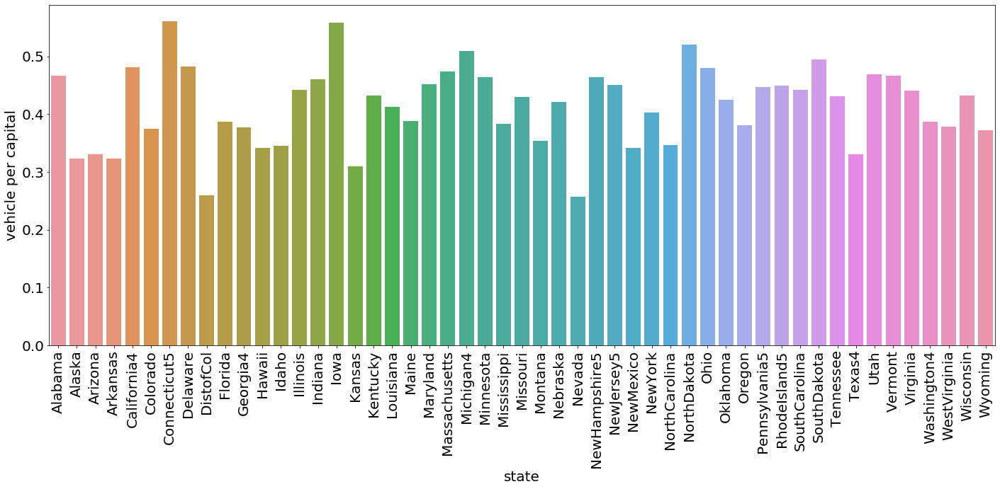


```python
len(population)
```


    51


```python
len(count_data['count'])
```


    51


```python
sell_car_per_person =[]
for i in range(len(population)):
    sell_car_per_person.append(count_data['count'].iloc[i]/population.iloc[i])
```


```python
car_per_cap2_state = car_per_cap2_state.reset_index()
```


```python
car_per_cap2_state = car_per_cap2_state.drop(columns = 'index')
```


```python
plt.figure(figsize = (20,10))
fbar = sns.barplot(x=np.squeeze(car_per_cap2_state.values), y=sell_car_per_person)
plt.xticks(rotation=90)                                                               
plt.ylabel('population')
plt.xlabel('state')
plt.tight_layout()B

plt.savefig('car_sell_per_person.jpg')
```


```python
sell_car_per_person_corrected =[]
for i in range(len(population)):
    sell_car_per_person_corrected.append\
    (count_data['count'].iloc[i]*car_per_cap2_num.iloc[i].values/population.iloc[i])
```


```python
plt.figure(figsize = (20,10))
fbar = sns.barplot(x=np.squeeze(car_per_cap2_state.values), y=np.squeeze(sell_car_per_person_corrected))
plt.xticks(rotation=90)                                                               
plt.ylabel('population')
plt.xlabel('state')
plt.tight_layout()

plt.savefig('car_sell_per_person_corrected.jpg')
```


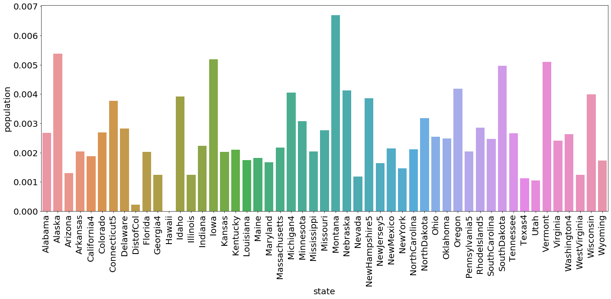


```python
data1.manufacturer.unique()
```


    array(['dodge', nan, 'ford', 'gmc', 'jeep', 'bmw', 'chevy', 'ram',
           'cadillac', 'kia', 'chevrolet', 'rover', 'mercedes', 'volkswagen',
           'nissan', 'honda', 'infiniti', 'toyota', 'lexus', 'mini', 'mazda',
           'hyundai', 'saturn', 'vw', 'chrysler', 'lincoln', 'mitsubishi',
           'buick', 'acura', 'chev', 'mercury', 'fiat', 'pontiac', 'volvo',
           'audi', 'subaru', 'mercedes-benz', 'jaguar', 'datsun', 'infinity',
           'harley', 'alfa', 'ferrari', 'porche', 'noble', 'land rover',
           'harley-davidson', 'alfa-romeo', 'landrover', 'mercedesbenz',
           'aston', 'aston-martin', 'morgan', 'hennessey'], dtype=object)


```python
new_group = data1.groupby(['manufacturer','state_name']).count().price
```


```python
new_group.head(5)
```


    manufacturer  state_name
    acura         Alabama        329
                  Alaska          81
                  Arizona        160
                  Arkansas       129
                  California    2259
    Name: price, dtype: int64


```python
new_group['honda'].index
```


    Index(['Alabama', 'Alaska', 'Arizona', 'Arkansas', 'California', 'Colorado',
           'Connecticut', 'Delaware', 'District of Columbia', 'Florida', 'Georgia',
           'Hawaii', 'Idaho', 'Illinois', 'Indiana', 'Iowa', 'Kansas', 'Kentucky',
           'Louisiana', 'Maine', 'Maryland', 'Massachusetts', 'Michigan',
           'Minnesota', 'Mississippi', 'Missouri', 'Montana', 'Nebraska', 'Nevada',
           'New Hampshire', 'New Jersey', 'New Mexico', 'New York',
           'North Carolina', 'North Dakota', 'Ohio', 'Oklahoma', 'Oregon',
           'Pennsylvania', 'Rhode Island', 'South Carolina', 'South Dakota',
           'Tennessee', 'Texas', 'Utah', 'Vermont', 'Virginia', 'Washington',
           'West Virginia', 'Wisconsin', 'Wyoming'],
          dtype='object', name='state_name')


```python
plt.figure(figsize = (20,10))
fbar = sns.barplot(x=new_group['honda'].index, y=new_group['honda'].values)
plt.xticks(rotation=90)                                                           
plt.ylabel('honda sell')
plt.xlabel('state')
plt.tight_layout()

plt.savefig('honda_state.jpg')
```


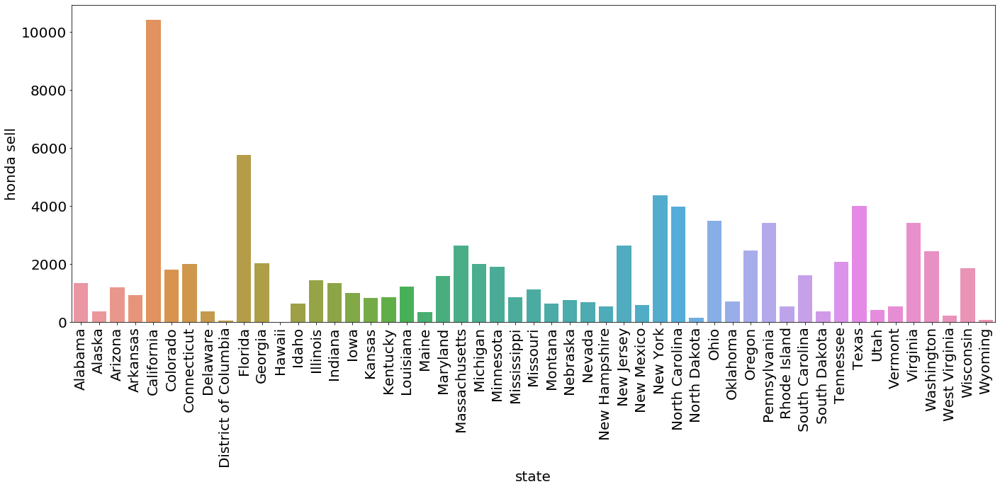


```python
len(data1.city.unique())
```


    446


```python
new_group2 = data1.groupby(['city','manufacturer']).count().price
```


```python
plt.figure(figsize = (20,10))
fbar = sns.barplot(x=new_group2.omaha.index, y=new_group2.omaha.values)
plt.xticks(rotation=90)                                                           
plt.ylabel('sell')
plt.xlabel('manufacturer')
plt.tight_layout()

plt.savefig('omaha.jpg')
```


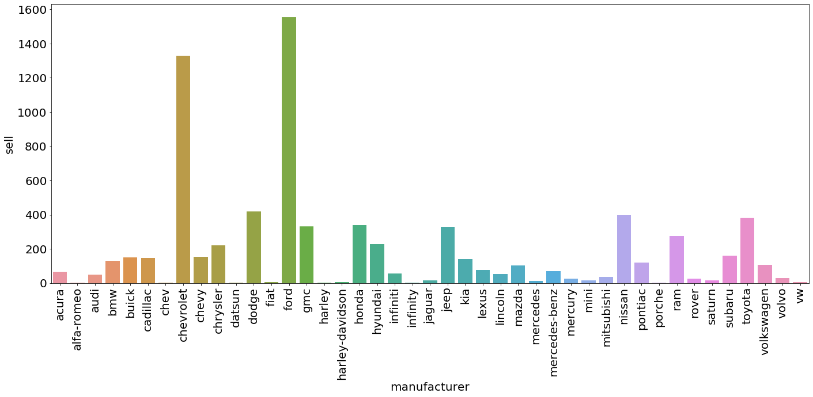


In omaha, Honda is not the most, but maybe it is growing so that is why worth working on

Next question: 
    1. Which state is more price sensitive
    2. Price range for difference maker
    


```python
new_group3 = data1.groupby(['manufacturer']).mean().price
```


```python
plt.figure(figsize = (20,10))
fbar = sns.barplot(x=new_group3.index, y=new_group3.values)
plt.xticks(rotation=90)                                                           
plt.ylabel('average price')
plt.xlabel('manufacturer')
plt.tight_layout()

plt.savefig('price.jpg')
```


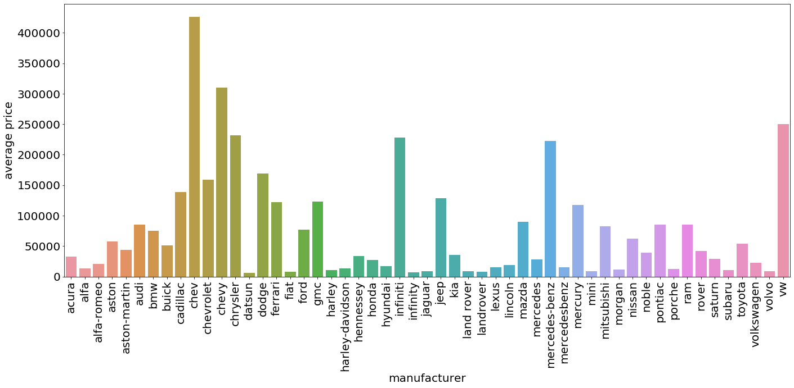


Honda is in the lower range


```python
new_group4 = data1.groupby(['state_name']).mean().price
```


```python
plt.figure(figsize = (20,10))
fbar = sns.barplot(x=new_group4.index, y=new_group4.values)
plt.xticks(rotation=90)                                                           
plt.ylabel('price')
plt.xlabel('state')
plt.tight_layout()

plt.savefig('price_state.jpg')
```


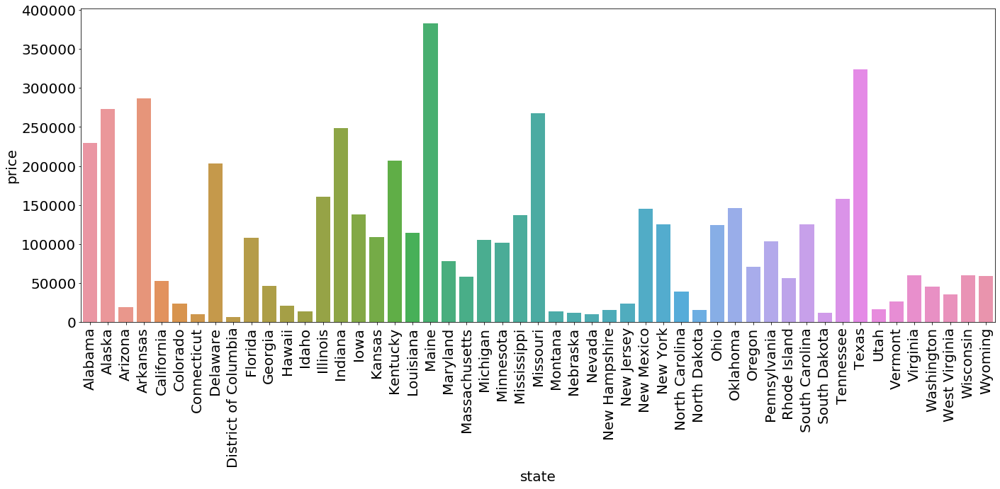


Nebraska is on the cheap side, so maybe that is why


```python
income_data = pd.read_excel('spi0619.xlsx').iloc[4:-5]
```


```python
index = np.asarray([6, 13, 20, 26, 34, 47, 52, 58])
index = index - 6
```


```python
income_data_clean = income_data.drop(income_data.index[index])
```


```python
for i, item in enumerate(income_data_clean['Table 1. Personal Income, by State and Region, 2017:Q4-2019:Q1'].values):
    income_data_clean['Table 1. Personal Income, by State and Region, 2017:Q4-2019:Q1'].iloc[i] = \
    str(income_data_clean['Table 1. Personal Income, by State and Region, 2017:Q4-2019:Q1'].iloc[i]).replace(" ", "")
```


```python
income_data_clean = income_data_clean.set_index('Table 1. Personal Income, by State and Region, 2017:Q4-2019:Q1')
```


```python
income_data_clean = income_data_clean.sort_index()
```


```python
income_data_clean['Unnamed: 1'].iloc[0]
```


    201824


```python
income_data_clean['per_person'] = [income_data_clean['Unnamed: 1'].iloc[i] \
                                   /population[i+8] for i in range(51)]
```


```python
plt.figure(figsize = (20,10))
fbar = sns.barplot(x=income_data_clean.index, y=income_data_clean['per_person'].values*1000000)
plt.xticks(rotation=90)                                                           
plt.ylabel('annual income ($)')
plt.xlabel('state')
plt.tight_layout()

plt.savefig('income_state.jpg')
```


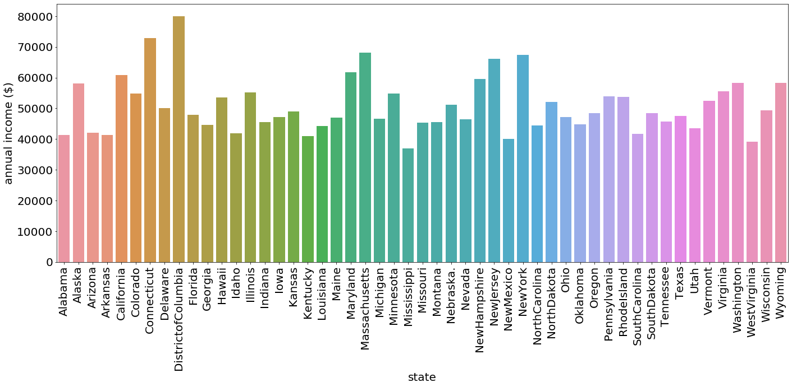


## Similiarity model


```python
data_select = data1[data1.state_name == 'California']\
[['city','price','manufacturer','make','fuel']]
data_select.info()
```

    <class 'pandas.core.frame.DataFrame'>
    Int64Index: 154299 entries, 106 to 1722706
    Data columns (total 5 columns):
    city            154299 non-null object
    price           154299 non-null int64
    manufacturer    141697 non-null object
    make            147643 non-null object
    fuel            153316 non-null object
    dtypes: int64(1), object(4)
    memory usage: 7.1+ MB


```python
data_select = data_select.dropna()
```


```python
data_select.info()
```

    <class 'pandas.core.frame.DataFrame'>
    Int64Index: 134111 entries, 113 to 1722706
    Data columns (total 5 columns):
    city            134111 non-null object
    price           134111 non-null int64
    manufacturer    134111 non-null object
    make            134111 non-null object
    fuel            134111 non-null object
    dtypes: int64(1), object(4)
    memory usage: 6.1+ MB


```python
data_select.head()
```


<div>
<style scoped>
    .dataframe tbody tr th:only-of-type {
        vertical-align: middle;
    }

    .dataframe tbody tr th {
        vertical-align: top;
    }

    .dataframe thead th {
        text-align: right;
    }
</style>
<table border="1" class="dataframe">
  <thead>
    <tr style="text-align: right;">
      <th></th>
      <th>city</th>
      <th>price</th>
      <th>manufacturer</th>
      <th>make</th>
      <th>fuel</th>
    </tr>
  </thead>
  <tbody>
    <tr>
      <th>113</th>
      <td>lasvegas</td>
      <td>4800</td>
      <td>honda</td>
      <td>crx</td>
      <td>gas</td>
    </tr>
    <tr>
      <th>347</th>
      <td>goldcountry</td>
      <td>18500</td>
      <td>nissan</td>
      <td>frontier</td>
      <td>gas</td>
    </tr>
    <tr>
      <th>348</th>
      <td>goldcountry</td>
      <td>2700</td>
      <td>ford</td>
      <td>f150</td>
      <td>gas</td>
    </tr>
    <tr>
      <th>349</th>
      <td>goldcountry</td>
      <td>3400</td>
      <td>audi</td>
      <td>a4 1.8t quattro</td>
      <td>gas</td>
    </tr>
    <tr>
      <th>350</th>
      <td>goldcountry</td>
      <td>1</td>
      <td>ford</td>
      <td>model t</td>
      <td>gas</td>
    </tr>
  </tbody>
</table>
</div>


```python
compared_data = data1[data1.city == 'omaha']\
[['city','price','manufacturer','make','fuel']]
```

I can convert the similarity measure problem to classification problem, the least easy to seperate from omaha is the most similar class


```python
data = [compared_data, data_select]
```


```python
data = pd.concat(data)
```


```python
data.info()
```

    <class 'pandas.core.frame.DataFrame'>
    Int64Index: 142163 entries, 9008 to 1722706
    Data columns (total 5 columns):
    city            142163 non-null object
    price           142163 non-null int64
    manufacturer    141696 non-null object
    make            141945 non-null object
    fuel            142045 non-null object
    dtypes: int64(1), object(4)
    memory usage: 6.5+ MB


```python
data.head()
```


<div>
<style scoped>
    .dataframe tbody tr th:only-of-type {
        vertical-align: middle;
    }

    .dataframe tbody tr th {
        vertical-align: top;
    }

    .dataframe thead th {
        text-align: right;
    }
</style>
<table border="1" class="dataframe">
  <thead>
    <tr style="text-align: right;">
      <th></th>
      <th>city</th>
      <th>price</th>
      <th>manufacturer</th>
      <th>make</th>
      <th>fuel</th>
    </tr>
  </thead>
  <tbody>
    <tr>
      <th>9008</th>
      <td>omaha</td>
      <td>7500</td>
      <td>ford</td>
      <td>f700</td>
      <td>diesel</td>
    </tr>
    <tr>
      <th>9012</th>
      <td>omaha</td>
      <td>17988</td>
      <td>mercedes-benz</td>
      <td>c-class c300 4mati</td>
      <td>gas</td>
    </tr>
    <tr>
      <th>9013</th>
      <td>omaha</td>
      <td>15988</td>
      <td>dodge</td>
      <td>journey r/t all wheel driv</td>
      <td>gas</td>
    </tr>
    <tr>
      <th>9014</th>
      <td>omaha</td>
      <td>15988</td>
      <td>buick</td>
      <td>enclave 1 owner awd heated</td>
      <td>gas</td>
    </tr>
    <tr>
      <th>9015</th>
      <td>omaha</td>
      <td>15988</td>
      <td>buick</td>
      <td>enclave auto 3.6l v6 awd s</td>
      <td>gas</td>
    </tr>
  </tbody>
</table>
</div>


```python
from sklearn.preprocessing import LabelEncoder
```


```python
data = data.dropna()
```


```python
data.info()
```

    <class 'pandas.core.frame.DataFrame'>
    Int64Index: 141363 entries, 9008 to 1722706
    Data columns (total 5 columns):
    city            141363 non-null object
    price           141363 non-null int64
    manufacturer    141363 non-null object
    make            141363 non-null object
    fuel            141363 non-null object
    dtypes: int64(1), object(4)
    memory usage: 6.5+ MB


```python
count = data.groupby('city').count()
```


```python
data_count = count[count.price>1000]

choosen_city = data_count.index

item = choosen_city[0]
data_new = data[data.city == item]

for item in choosen_city[1:]:
    data_new = [data_new, data[data.city == item]]
    data_new = pd.concat(data_new)

data_new.city.unique()
```


```python
y = data_new.city

le_y = LabelEncoder()
le_y.fit(y)
y = le_y.transform(y)
```


```python
le_y.transform(['omaha'])
```


    array([11])


```python
x = data_new[["price","manufacturer","fuel"]]

le = LabelEncoder()
le.fit(x.fuel)
x.fuel = le.transform(x.fuel)

# le2 = LabelEncoder()
# le2.fit(x.weather)
# x.weather = le2.transform(x.weather)

le3 = LabelEncoder()
le3.fit(x.manufacturer)
x.manufacturer = le3.transform(x.manufacturer)
```


```python
X_train, X_test, y_train, y_test = train_test_split(x, y, test_size=0.33, random_state=42)
```


```python
from sklearn.model_selection import train_test_split
```


```python
from  sklearn.ensemble import RandomForestClassifier
```


```python
clf = RandomForestClassifier()

model = clf.fit(X_train, y_train) 

model.score(X_test, y_test)
```


```python
from sklearn.metrics import confusion_matrix
```


```python
y_pred = model.predict(X_test)

confusion_matrix(y_test, y_pred)[11]

confusion_score = confusion_matrix(y_test, y_pred)[11]
```


```python
np.unique(y)
```


    array([ 0,  1,  2,  3,  4,  5,  6,  7,  8,  9, 10, 11, 12, 13, 14, 15, 16,
           17, 18, 19, 20, 21, 22, 23, 24, 25])


```python
label = le_y.inverse_transform([i for i in range(26)])
```


```python
plt.figure(figsize = (20,10))
fbar = sns.barplot(x=label, y=confusion_score)
plt.xticks(rotation=90)                                                           
plt.ylabel('confusion_score')
plt.xlabel('city')
plt.tight_layout()

plt.savefig('city_confuse.jpg')
```


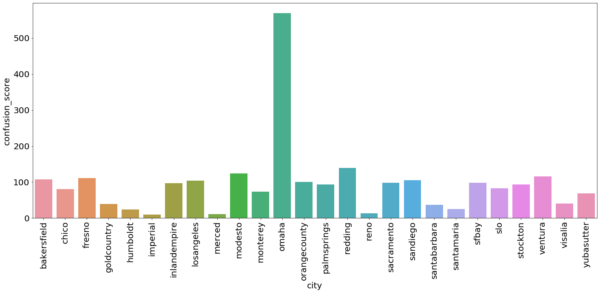


Not ideal, let us check all city


```python
data_select = data1[['city','price','manufacturer','make','fuel']]
data_select.info()
```

    <class 'pandas.core.frame.DataFrame'>
    Int64Index: 1664232 entries, 0 to 1723064
    Data columns (total 5 columns):
    city            1664232 non-null object
    price           1664232 non-null int64
    manufacturer    1531482 non-null object
    make            1596002 non-null object
    fuel            1655155 non-null object
    dtypes: int64(1), object(4)
    memory usage: 76.2+ MB


```python
data_select = data_select.dropna()
```


```python
data_select.info()
```

    <class 'pandas.core.frame.DataFrame'>
    Int64Index: 1454657 entries, 0 to 1723064
    Data columns (total 5 columns):
    city            1454657 non-null object
    price           1454657 non-null int64
    manufacturer    1454657 non-null object
    make            1454657 non-null object
    fuel            1454657 non-null object
    dtypes: int64(1), object(4)
    memory usage: 66.6+ MB


```python
data = data_select.dropna()
```


```python
data.info()
```

    <class 'pandas.core.frame.DataFrame'>
    Int64Index: 1454657 entries, 0 to 1723064
    Data columns (total 5 columns):
    city            1454657 non-null object
    price           1454657 non-null int64
    manufacturer    1454657 non-null object
    make            1454657 non-null object
    fuel            1454657 non-null object
    dtypes: int64(1), object(4)
    memory usage: 66.6+ MB


```python
count = data.groupby('city').count()
```


```python
data_count = count[count.price>1000]
choosen_city = data_count.index
```


```python
len(choosen_city)
```


    326


```python
item = choosen_city[0]
data_new = data[data.city == item]

for item in choosen_city[1:]:
    data_new = [data_new, data[data.city == item]]
    data_new = pd.concat(data_new)

data_new.city.unique()
```


    array(['abilene', 'akroncanton', 'albany', 'albuquerque', 'allentown',
           'altoona', 'amarillo', 'anchorage', 'annapolis', 'annarbor',
           'appleton', 'asheville', 'athensga', 'atlanta', 'augusta',
           'austin', 'bakersfield', 'baltimore', 'batonrouge', 'battlecreek',
           'bellingham', 'bemidji', 'bend', 'bgky', 'bham', 'billings',
           'binghamton', 'bloomington', 'bn', 'boise', 'boston', 'boulder',
           'bozeman', 'brainerd', 'brownsville', 'brunswick', 'buffalo',
           'capecod', 'carbondale', 'cedarrapids', 'centralmich', 'chambana',
           'charleston', 'charlestonwv', 'charlotte', 'charlottesville',
           'chattanooga', 'chicago', 'chico', 'chillicothe', 'cincinnati',
           'clarksville', 'cleveland', 'cnj', 'collegestation', 'columbia',
           'columbiamo', 'columbus', 'columbusga', 'corpuschristi',
           'corvallis', 'cosprings', 'dallas', 'danville', 'dayton',
           'daytona', 'delaware', 'denver', 'desmoines', 'detroit', 'dothan',
           'dubuque', 'duluth', 'easternshore', 'eastidaho', 'eastky',
           'eastnc', 'eastoregon', 'easttexas', 'eauclaire', 'elmira',
           'elpaso', 'erie', 'eugene', 'evansville', 'fairbanks', 'fargo',
           'fayar', 'fayetteville', 'fingerlakes', 'flagstaff', 'flint',
           'florencesc', 'fortcollins', 'fortmyers', 'fortsmith', 'fortwayne',
           'frederick', 'fredericksburg', 'fresno', 'gadsden', 'gainesville',
           'goldcountry', 'grandforks', 'grandisland', 'grandrapids',
           'greatfalls', 'greenbay', 'greensboro', 'greenville', 'gulfport',
           'harrisburg', 'harrisonburg', 'hartford', 'hattiesburg', 'helena',
           'hickory', 'holland', 'houston', 'hudsonvalley', 'humboldt',
           'huntington', 'huntsville', 'imperial', 'indianapolis',
           'inlandempire', 'iowacity', 'ithaca', 'jackson', 'jacksontn',
           'jacksonville', 'janesville', 'jerseyshore', 'jonesboro', 'joplin',
           'jxn', 'kalamazoo', 'kalispell', 'kansascity', 'killeen',
           'klamath', 'knoxville', 'kpr', 'lacrosse', 'lafayette', 'lakecity',
           'lakeland', 'lancaster', 'lansing', 'laredo', 'lascruces',
           'lasvegas', 'lawton', 'lewiston', 'lexington', 'limaohio',
           'lincoln', 'littlerock', 'longisland', 'losangeles', 'louisville',
           'loz', 'lubbock', 'lynchburg', 'macon', 'madison', 'maine',
           'mankato', 'mansfield', 'mcallen', 'medford', 'memphis', 'merced',
           'miami', 'milwaukee', 'minneapolis', 'missoula', 'mobile',
           'modesto', 'mohave', 'monroe', 'monroemi', 'monterey',
           'montgomery', 'morgantown', 'moseslake', 'muncie', 'muskegon',
           'myrtlebeach', 'nashville', 'newhaven', 'newjersey', 'newlondon',
           'neworleans', 'newyork', 'nh', 'nmi', 'norfolk', 'northernwi',
           'northmiss', 'nwct', 'nwga', 'ocala', 'odessa', 'okaloosa',
           'oklahomacity', 'olympic', 'omaha', 'onslow', 'orangecounty',
           'oregoncoast', 'orlando', 'ottumwa', 'palmsprings', 'panamacity',
           'parkersburg', 'pennstate', 'pensacola', 'peoria', 'philadelphia',
           'phoenix', 'pittsburgh', 'plattsburgh', 'poconos', 'porthuron',
           'portland', 'prescott', 'providence', 'pueblo', 'pullman',
           'quadcities', 'racine', 'raleigh', 'rapidcity', 'reading',
           'redding', 'reno', 'richmond', 'rmn', 'roanoke', 'rochester',
           'rockford', 'rockies', 'roseburg', 'sacramento', 'saginaw',
           'salem', 'saltlakecity', 'sanantonio', 'sandiego', 'santabarbara',
           'santafe', 'santamaria', 'sarasota', 'savannah', 'scranton', 'sd',
           'seattle', 'seks', 'semo', 'sfbay', 'sheboygan', 'shoals',
           'showlow', 'shreveport', 'siouxcity', 'siouxfalls', 'skagit',
           'slo', 'smd', 'southbend', 'southcoast', 'southjersey',
           'spacecoast', 'spokane', 'springfield', 'springfieldil',
           'staugustine', 'stcloud', 'stgeorge', 'stjoseph', 'stlouis',
           'stockton', 'swmi', 'syracuse', 'tallahassee', 'tampa',
           'terrehaute', 'texoma', 'tippecanoe', 'toledo', 'topeka',
           'treasure', 'tricities', 'tucson', 'tulsa', 'twinfalls', 'up',
           'utica', 'valdosta', 'ventura', 'vermont', 'visalia', 'waco',
           'washingtondc', 'waterloo', 'watertown', 'wausau', 'wenatchee',
           'westernmass', 'westky', 'westslope', 'wichita', 'wichitafalls',
           'williamsport', 'wilmington', 'winchester', 'winstonsalem',
           'worcester', 'wyoming', 'yakima', 'york', 'youngstown',
           'yubasutter', 'yuma', 'zanesville'], dtype=object)


```python
y = data_new.city

le_y = LabelEncoder()
le_y.fit(y)
y = le_y.transform(y)
```


```python
le_y.transform(['omaha'])
```


    array([207])


```python
x = data_new[["price","manufacturer","fuel"]]

le = LabelEncoder()
le.fit(x.fuel)
x.fuel = le.transform(x.fuel)

# le2 = LabelEncoder()
# le2.fit(x.weather)
# x.weather = le2.transform(x.weather)

le3 = LabelEncoder()
le3.fit(x.manufacturer)
x.manufacturer = le3.transform(x.manufacturer)
```

    /home/ubuntu/anaconda3/envs/tensorflow_p36/lib/python3.6/site-packages/pandas/core/generic.py:5096: SettingWithCopyWarning: 
    A value is trying to be set on a copy of a slice from a DataFrame.
    Try using .loc[row_indexer,col_indexer] = value instead
    
    See the caveats in the documentation: http://pandas.pydata.org/pandas-docs/stable/indexing.html#indexing-view-versus-copy
      self[name] = value


```python
X_train, X_test, y_train, y_test = train_test_split(x, y, test_size=0.33, random_state=42)
```


```python
clf = RandomForestClassifier()

model = clf.fit(X_train, y_train) 

model.score(X_test, y_test)
```

    /home/ubuntu/anaconda3/envs/tensorflow_p36/lib/python3.6/site-packages/sklearn/ensemble/forest.py:245: FutureWarning: The default value of n_estimators will change from 10 in version 0.20 to 100 in 0.22.
      "10 in version 0.20 to 100 in 0.22.", FutureWarning)


    0.05676594863118642


```python
y_pred = model.predict(X_test)
confusion_score = confusion_matrix(y_test, y_pred)[207]
```


```python
label = le_y.inverse_transform([i for i in range(326)])
```


```python
plt.figure(figsize = (20,10))
fbar = sns.barplot(x=label, y=confusion_score)
plt.xticks(rotation=90)                                                           
plt.ylabel('confusion_score')
plt.xlabel('city')
plt.tight_layout()

plt.savefig('city_confuse2.jpg')
```


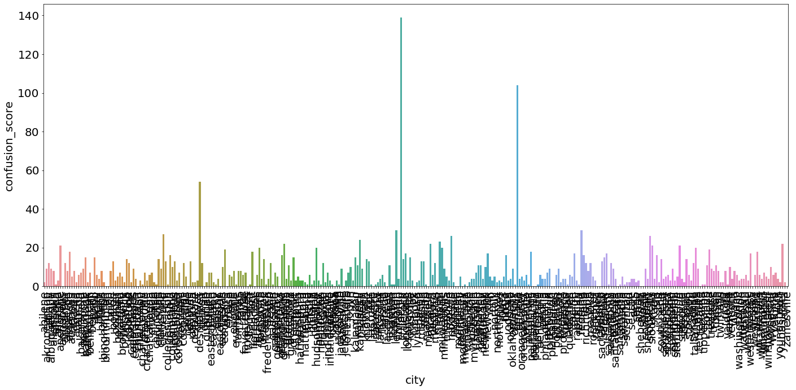


```python
final_similarity = list(zip(label, confusion_score))
```


```python
index_choosen = np.where(confusion_score>20)
```


```python
label[index_choosen]
```


    array(['anchorage', 'cleveland', 'desmoines', 'grandrapids', 'kansascity',
           'lexington', 'lincoln', 'mcallen', 'miami', 'modesto', 'omaha',
           'redding', 'siouxcity', 'siouxfalls', 'stcloud', 'yubasutter'],
          dtype=object)


```python
plt.figure(figsize = (20,10))
fbar = sns.barplot(x=label[index_choosen], y=confusion_score[index_choosen])
plt.xticks(rotation=90)                                                           
plt.ylabel('confusion_score')
plt.xlabel('city')
plt.tight_layout()

plt.savefig('city_confuse_final.jpg')
```


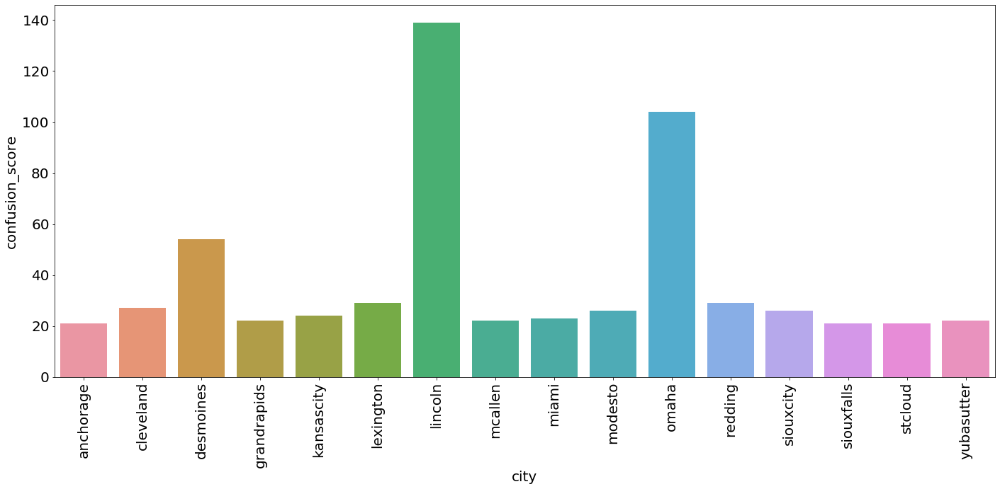

