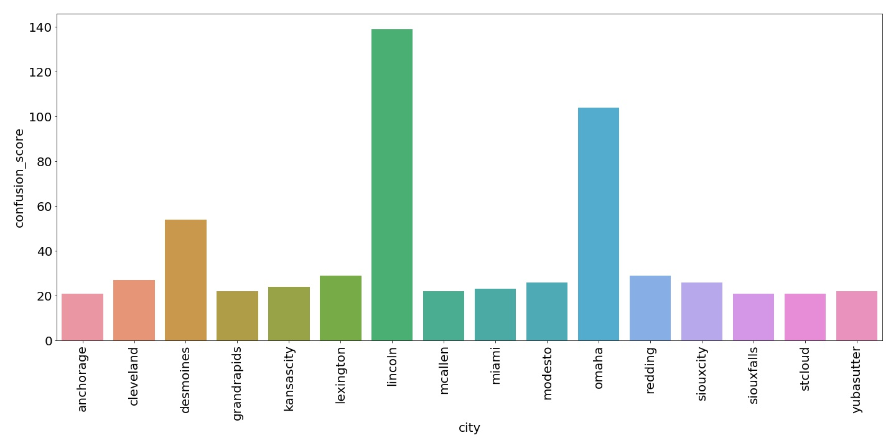
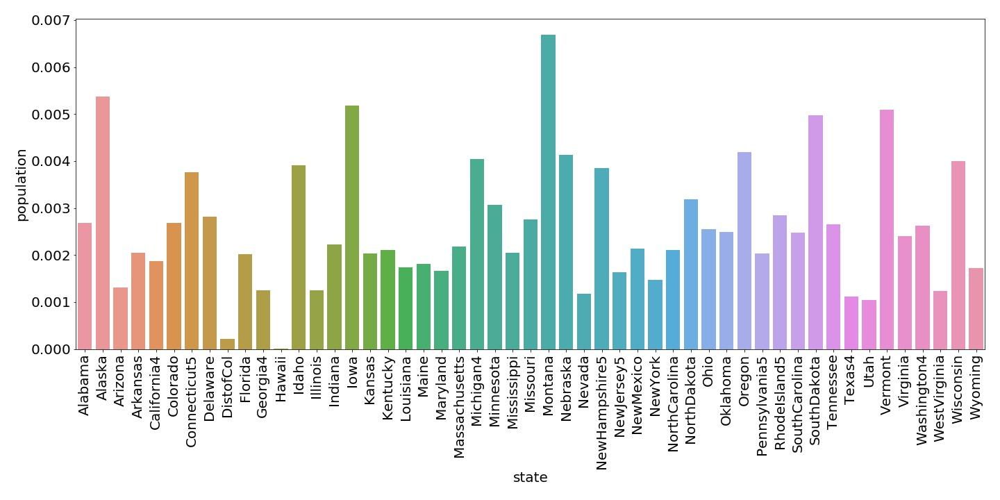

# Find similar car markets
## Background
We have discovered a strong regional demand for Honda in Omaha, NE and would like to know what other regional markets have similar demand to expand. 

## Data
I have uploaed the external demographic data that I downloaded from the [US Census Bureau](https://www.census.gov/data.html) here. The car sell data was scrapped from Craigslist, it can be downloaded [here](https://drive.google.com/file/d/1GhU4ekpsQv68RgqSUoCWJQ11DAhEbQ3F/view?usp=sharing).

## Insight
There are three main methods to find similarities between two items: cosine, dot product and Euclidean distance. Cosine is not sensitive to the length of the vector, therefore, can be used for data with features that at in different scales.

While we could use cosine similarity to find which city is similar to Omaha. It will still be difficult to convert different categorical data. Two cities that are similar will be difficult to be distinguish from one to another in classification. Therefore, instead of using cosine similarity comparision, I first develop a classification on the city level, and then look at the confusion matrix's score of the classification prediction to see which cities are more likely to misclassified as Omaha.

## Results

#### City level top picks
Below is the barplot of the row of Omaha in the confusion matrix. The higher the score, the more likely that it is classified as Omaha in the model, therefore, the more similar it is to Omaha. 

By plotting the row of omaha in our classification's confusion matrix, two cities stand out: Des Moines and Lincoln, both of which is geographically close to omaha. By acquiring external demographic data we can see other reasons behind this similarity:

#### State level top picks

From the data, we can also extract some information at the state level instead of city. I gather extra data from the US Census Bureun in state population and vehicles owned per capital in each state. As we can estimate that: Market size = population * car ownership per capita.

By dividing the current car sale by the market size, we can see which states' market is saturated and which is not. In the barplot below, the lower the bar, the less market saturation, thus, more promising market.

## Conclusions:
In this repo, I show how to use machine learning method to find promising market for expansion. However, this is a very simplied model. In reality, we should also look at the competitiors at the market we would like to expand. For example, how many competitiors are there, what size are they? If the market is dominated by one single player, it may be difficult to expand. 

