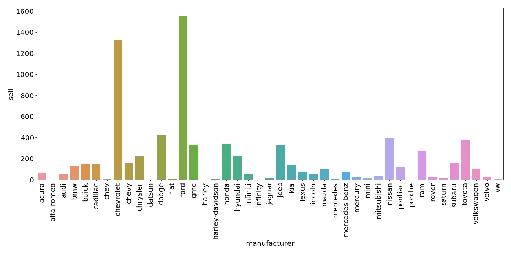
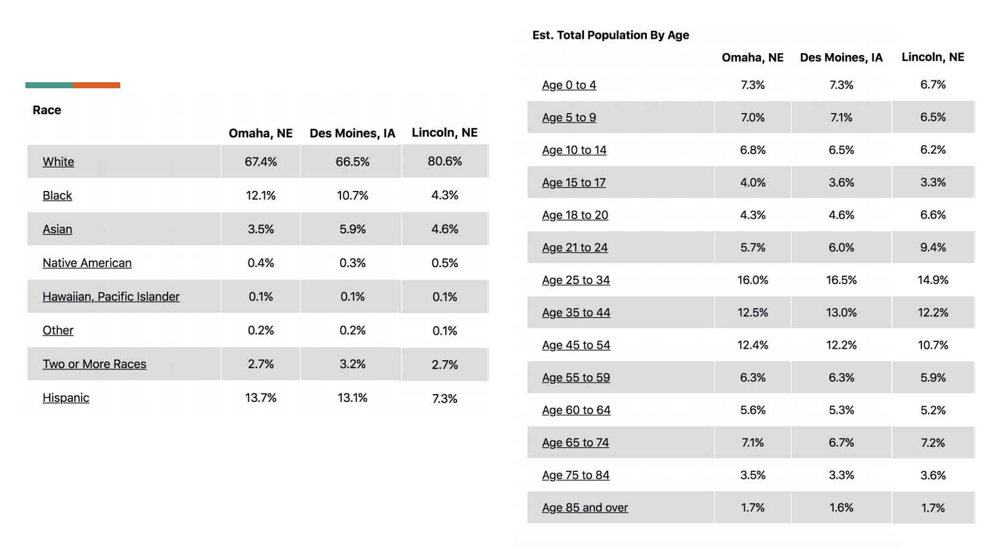

# Honk4Honda
## Background:
You’re on the data science team at Honda. Your team is trying to understand regional automotive demand in the United States, as you plan your manufacturing goals. 

Through some limited market research we’ve discovered a strong regional demand for Honda in Omaha, NE. We’d like to know what other regional markets have similar demand:  . 
What are some promising markets for Honda to expand to? What makes it promising? How do we know that we’re not over saturating the market or expanding into a hostile market? 
Are there any other interesting insights or trends that are actionable?

## Insight:
While we could use cosine similarity to find which city is similar to Omaha. It will be difficult to convert different categorical data. Therefore, here, I work on the opposite problem. Two cities that are similar will be difficult to seperate, in other words, classified. Therefore, what I need to do is to make a classification, and then look at the confusion matrix's score to see which cities are more likely to classified as Omaha.

### Fact checking:
Market research shows a strong regional demand for Honda in Omaha, NE, but can we replicate the success?

As we show here, Honda is not the dominant brand in Omaha. Therefore, the marketing team may mean there is a increase in denmand rather than obsolute values. 

### Top picks
By plotting the row of omaha in our classification's confusion matrix, two cities stand out: Des Moines and Lincoln, both of which is geographically close to omaha. By acquiring external demographic data we can see other reasons behind this similarity:

## Other

## insights

##### Number of car sell

##### Total value of car sell

## Other

## insights

##### Car sale / Market size

##### Market size = population * car ownership per capita

